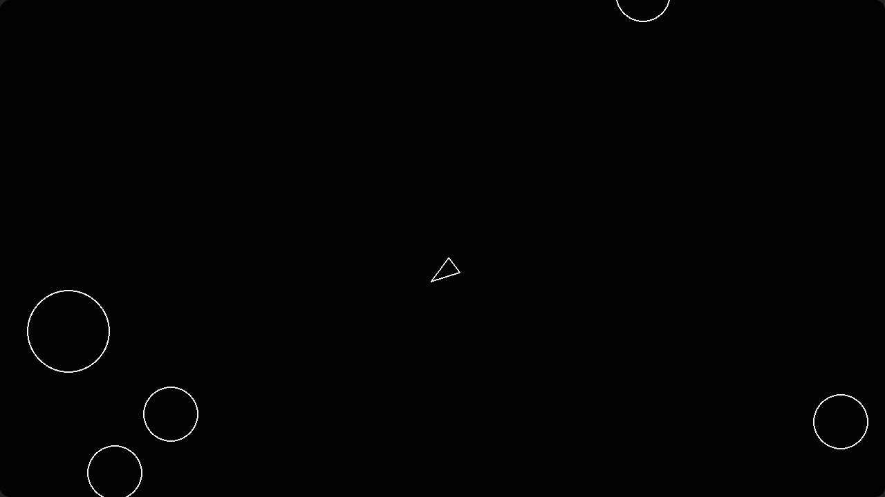

# Asteroids
 
A classic Asteroids arcade game built with Python and Pygame.
 
---
 
## Demo
 

 
---
 
## Features
 
- Classic Asteroids arcade gameplay
- Asteroids split into smaller pieces when shot
- Shooting cooldown mechanic
- Game over when an asteroid collides with the player
- Randomized asteroid field generation
---
 
## Controls
 
| Key | Action |
|-----|--------|
| `W` | Move forward |
| `A` | Rotate left |
| `D` | Rotate right |
| `Spacebar` | Shoot |
 
---
 
## Installation

1. Install [uv](https://docs.astral.sh/uv/getting-started/installation/) if you don't have it.

2. Clone the repository:
```bash
   git clone https://github.com/javlonbekrasulov/asteroids.git
   cd asteroids
```

3. Run the game:
```bash
   uv run main.py
```

## License

This project is licensed under the [MIT License](LICENSE).